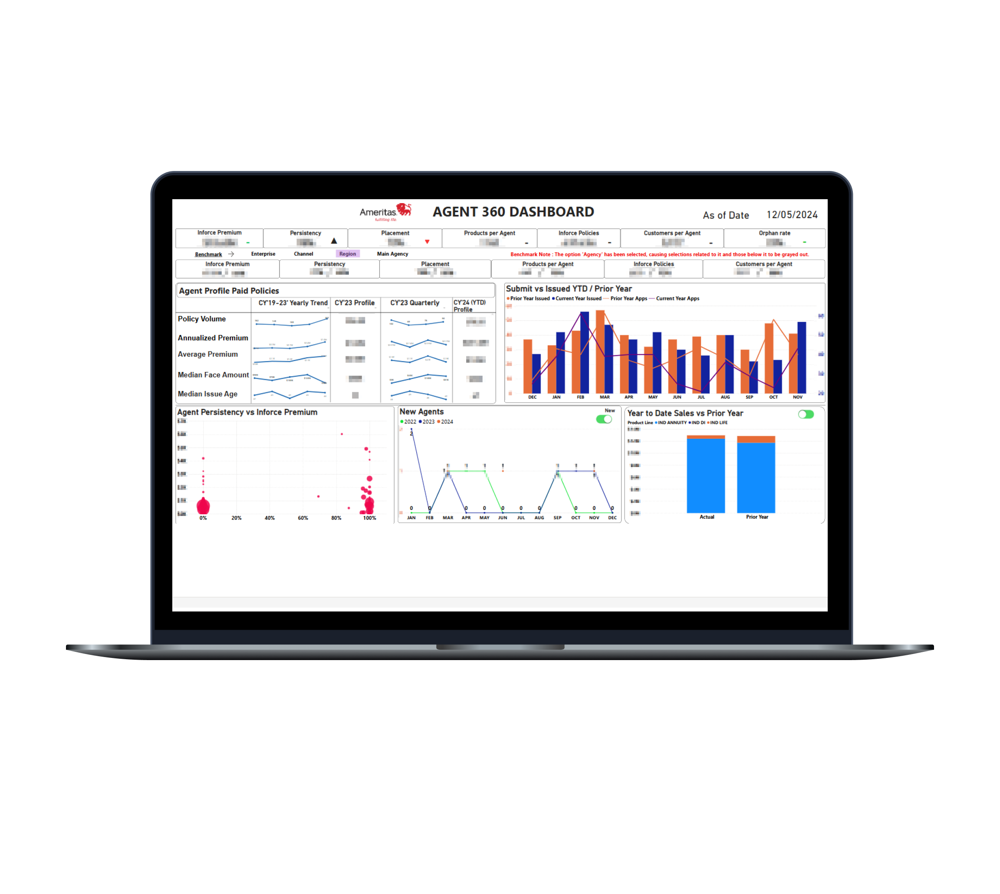
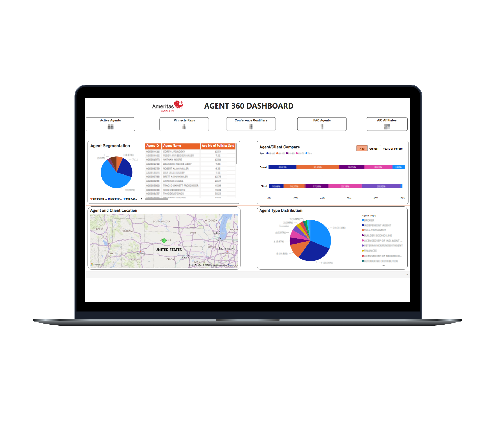
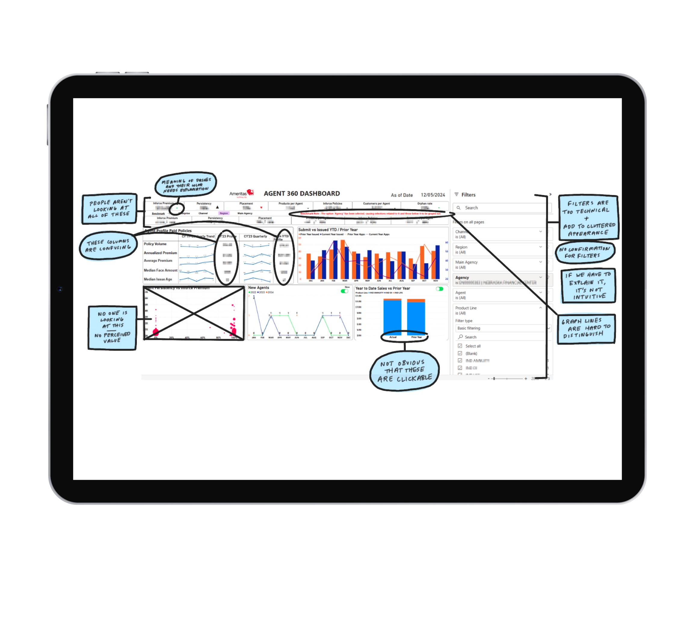
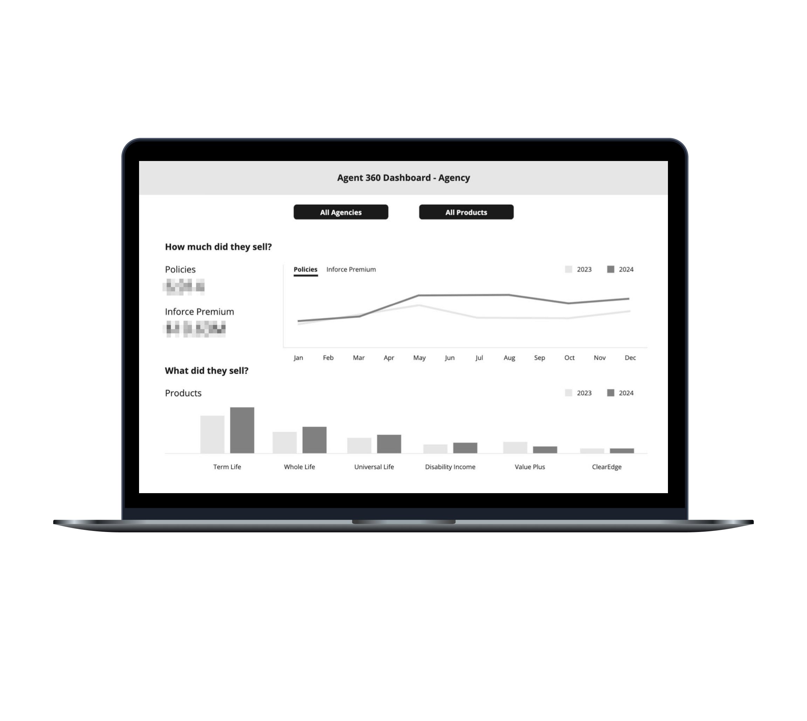
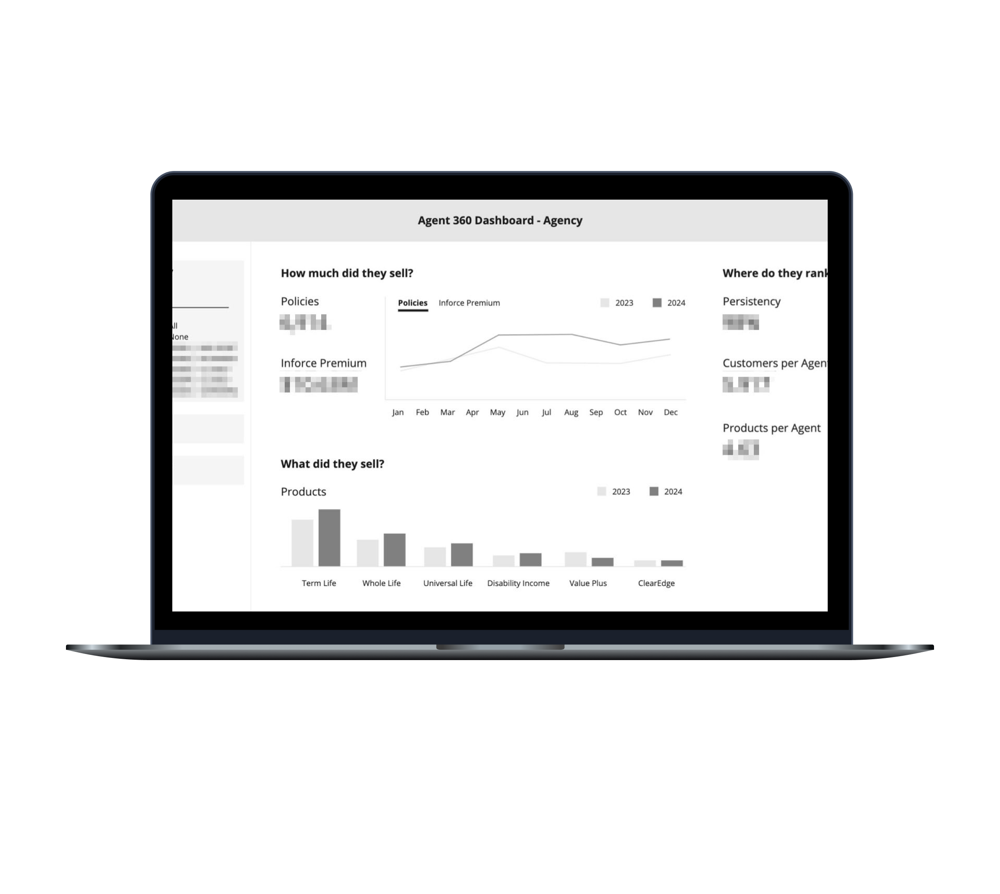

<!-- Main -->

<!-- One -->
<section id="one">
	

		<header class="major">
			<h2>Project Summary</h2>
		</header>
		<dl>
			<dt>My Role</dt>
			<dd>Research, Strategy, UX Design, Visual Design</dd>
			

			<dt>Timeframe</dt>
			<dd>2 months</dd>
			

			<dt>Outcome</dt>
			<dd>Improved dashboard experience for increased engagement</dd>
		</dl>
	

</section>

<!-- Two -->
<section id="two" class="spotlights">
	<section>
		

			
		

		

			

				<header class="major">
					<h3>Client</h3>
				</header>
					
Ameritas Life Insurance offers a wide range of financial products and services to individuals, families, and businesses. During my time there, I led the redesign of an internal sales dashboard used by senior leadership.

			

		

	</section>
	<section>
		

			
		

		

			

				<header class="major">
					<h3>Challenge</h3>
				</header>
					
The existing sales dashboard was overloaded with data and difficult to navigate, resulting in low usage. The challenge was to optimize the dashboard to make it more user-friendly, insightful, and aligned with executive decision-making needs.

			

		

	</section>
	<section>
		

			
		

		

			

				<header class="major">
					<h3>Users & Audience</h3>
				</header>
					
The primary users were high-level Ameritas executives who needed quick, actionable insights into agency and agent performance. Their goals included identifying top and bottom performers, understanding sales trends, and making strategic decisions based on real-time data.

			

		

	</section>
	<section>
		

			
		

		

			

				<header class="major">
					<h3>Roles & Responsibilities</h3>
				</header>
					
I served as the sole designer on the project. I collaborated closely with a Power BI specialist to bring the new design to life. My responsibilities included user research, UX strategy, interaction design, and stakeholder engagement.

			

		

	</section>
	<section>
		

			
		

		

			

				<header class="major">
					<h3>Scope & Constraints</h3>
				</header>
					
This was a high-profile initiative with a tight two-month timeline. We held regular review sessions with executive stakeholders to gather feedback and ensure the evolving design met their expectations. The scope included both redesigning the user experience and improving the dashboard's usability and visual clarity.

			

		

	</section>
	<section>
		

			
		

		

			

				<header class="major">
					<h3>Process / What We Did</h3>
				</header>
					
The original dashboard was essentially a data dump: dense, unstructured, and difficult to interpret. Our first step was to understand what executives actually needed from the dashboard. Through interviews and working sessions, we distilled their needs into a few key questions: “How much did they sell?”, “What did they sell?”, and “Where do they rank?”

					
Using these questions as a foundation, we restructured the dashboard to tell a clear, focused story. We prioritized high-level KPIs and enabled drill-down capabilities so users could explore data by line of business, category, or product. The design emphasized clarity, hierarchy, and ease of use, allowing executives to move seamlessly from overview to detail.

					
Throughout the process we iterated quickly, incorporating feedback from stakeholders and refining the design to ensure it aligned with their mental models and workflows.

			

		

	</section>
	<section>
		

			
		

		

			

				<header class="major">
					<h3>Outcomes & Lessons</h3>
				</header>
					
While I don't have access to usage analytics, the qualitative feedback was clear. Before the redesign, executives frequently complained about the dashboard's complexity. After the redesign, those complaints stopped, and were replaced by feature requests. To me, that's a strong indicator of success: when users start asking for more, it means they're engaged and see value in the product.

					
This project reinforced the importance of designing around user intent, not just data availability. It also highlighted the value of close collaboration between design and technical implementation to ensure a seamless user experience.

			

		

	</section>
</section>

<!-- Three -->
<section id="three">
	

		<header class="major">
			<h2>Why It Matters</h2>
		</header>
		
This project demonstrates my ability to:

		<ul class="bullets">
			<li>Lead UX strategy and execution from discovery through delivery</li>
			<li>Translate complex data into intuitive, actionable interfaces</li>
			<li>Collaborate cross-functionally to deliver high-impact solutions</li>
			<li>Operate independently while aligning with business goals</li>
			<li>Drive adoption and engagement through thoughtful, user-centered design</li>
		</ul>
	

	

		

			

			<header class="major">
				<h3>More Case Studies</h3>
			</header>
			<ul>
				<li><a href="cs2-openn">Home Buying UX Improvement</a></li>
				<li><a href="cs3-abr">Remote Oral Exam Design</a></li>
				<li><a href="cs4-apfm">Optimized Post-Lead Experience</a></li>
				<li><a href="cs5-motion">Product Configurator Feature</a></li>
				<li><a href="cs6-leankit">Benefits Page Improvement</a></li>
			</ul>
		

	

	

</section>

