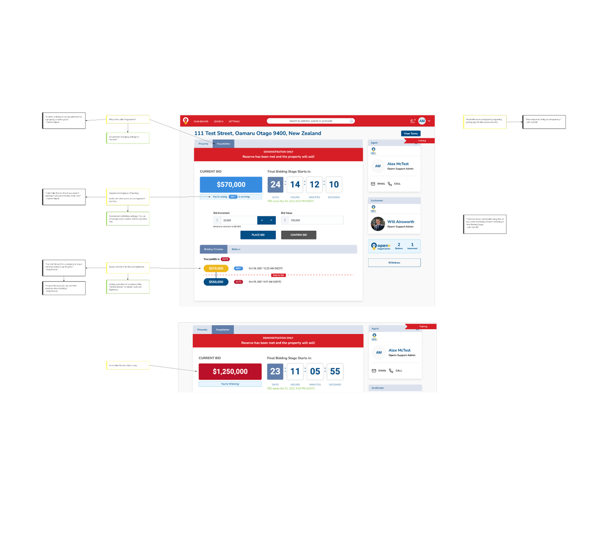
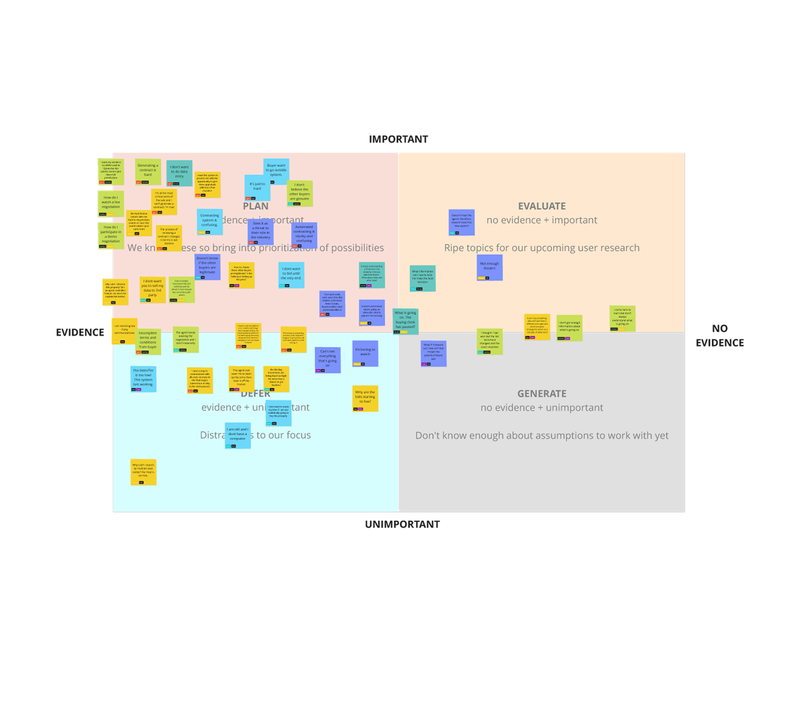
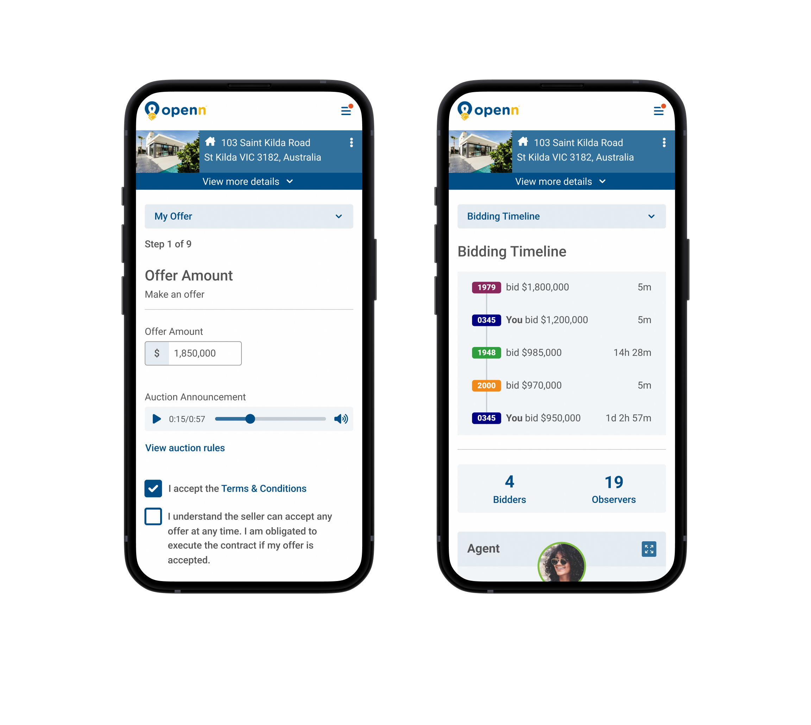
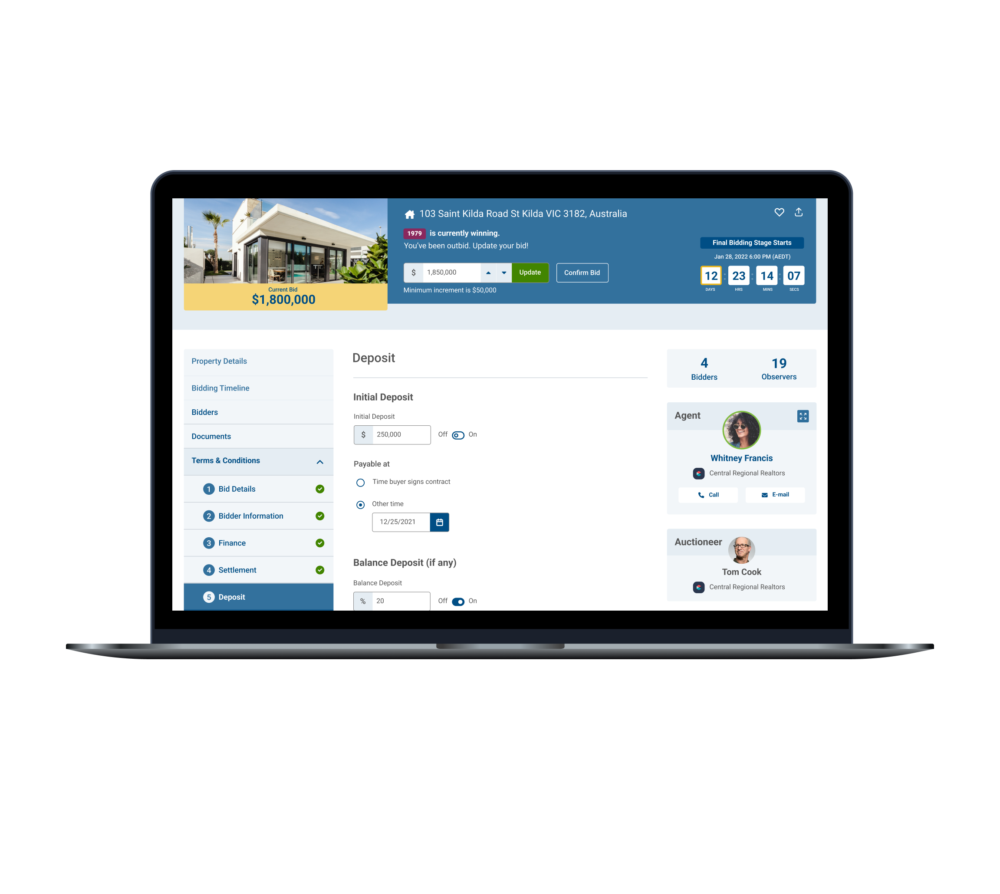
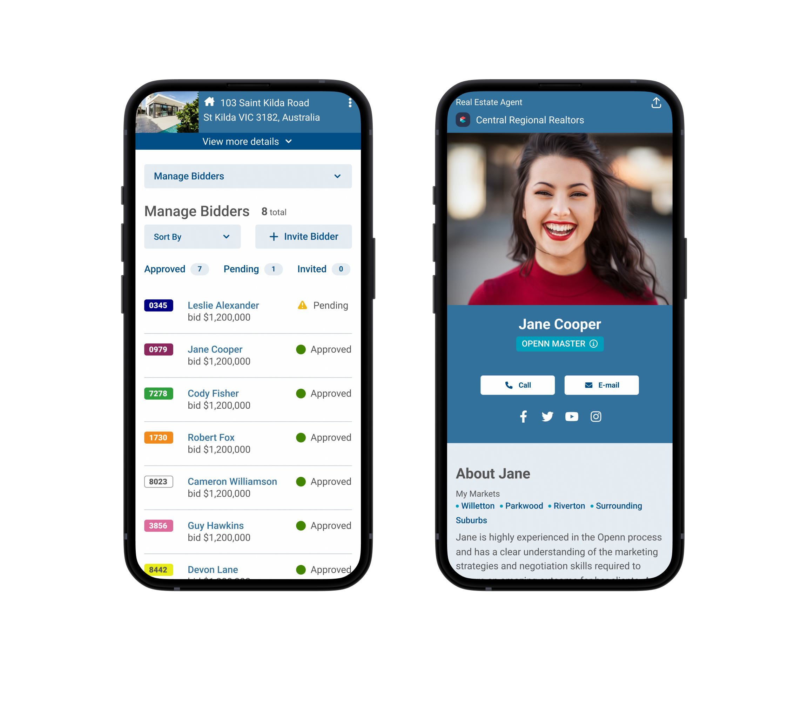

<!-- Main -->

<!-- One -->
<section id="one">
	

		<header class="major">
			<h2>Project Summary</h2>
		</header>
		<dl>
			<dt>My Role</dt>
			<dd>Research, Strategy, UX Design, Visual Design</dd>
			

			<dt>Timeframe</dt>
			<dd>17 weeks</dd>
			

			<dt>Outcome</dt>
			<dd>Simplified online home buying experience for increased trust</dd>
		</dl>
	

</section>

<!-- Two -->
<section id="two" class="spotlights">
	<section>
		

			
		

		

			

				<header class="major">
					<h3>The Challenge</h3>
				</header>
					
<strong>The Problem:</strong> Openn, an online property platform, needed to simplify a high-stakes, multi-step home buying process. The existing experience was confusing and failed to build user trust, which was critical given the significant financial decisions involved.

					<ul>
						<li><strong>Result:</strong> The platform's complexity was a barrier to market share growth and their planned expansion into the U.S.</li>
						<li><strong>Core Issue:</strong> Users (both buyers and agents) felt a significant disconnect between the digital process and the physical property, creating anxiety and a lack of trust.</li>
					</ul>
			

		

	</section>
	<section>
		

			
		

		

			

				<header class="major">
					<h3>My Role</h3>
				</header>
					
As the <strong>strategy and design lead</strong> on a three-person design team, I drove the end-to-end UX for a complete overhaul of the platform's core user experience.

					<ul>
						<li><strong>My Contribution:</strong> I was responsible for the strategic direction, user research, interaction design, and stakeholder management, ensuring the design aligned with user needs and business goals.</li>
					</ul>
			

		

	</section>
	<section>
		

			
		

		

			

				<header class="major">
					<h3>The Process</h3>
				</header>
					
My approach centered on simplifying complexity and building user trust.

					<ul>
						<li><strong>User Research:</strong> We conducted interviews with both Australian and U.S. users, discovering a key insight: Americans were unfamiliar with the auction process and felt anxious. Users needed to feel a constant connection to the property they were bidding on.</li>
						<li><strong>Information Architecture:</strong> Based on this insight, I redesigned the user flow to anchor the experience around the property itself. We moved away from a tab-based system to a streamlined, multi-step process with a persistent "property header" that anchored the user to the home they were trying to buy.</li>
						<li><strong>Usability Testing:</strong> We validated our new design through user testing, where participants reported a renewed sense of trust and connection to the property, successfully completing all key tasks without trouble.</li>
					</ul>
			

		

	</section>
	<section>
		

			
		

		

			

				<header class="major">
					<h3>The Solution</h3>
				</header>
					
I designed an intuitive, stepped experience that simplified the process of filling out required "paperwork" and submitting offers.

					<ul>
						<li><strong>Key Feature:</strong> The new design introduced a persistent header that provided a visual anchor for the user, reminding them of the property at every step. This simple change provided a critical layer of context and reassurance.</li>
					</ul>
			

		

	</section>
	<section>
		

			
		

		

			

				<header class="major">
					<h3>The Impact</h3>
				</header>
					
The project's success was measured by the overwhelmingly positive feedback from users and stakeholders, with all participants in our testing able to complete tasks without issues.

					<ul>
						<li><strong>The Result:</strong> The new design successfully bridged the gap between the process and the property, simplifying a complex, high-stakes experience and building the foundation of trust necessary for Openn's market expansion.</li>
					</ul>
			

		

	</section>
</section>

<!-- Three -->
<section id="three">
	

		

			

			<header class="major">
				<h3>More Case Studies</h3>
			</header>
			<ul>
				<li><a href="cs1-ameritas">Sales Insights Dashboard</a></li>
				<li><a href="cs3-abr">Remote Oral Exam Platform</a></li>
				<li><a href="cs4-apfm">Optimized Post-Lead Journey</a></li>
				<li><a href="cs5-motion">Optimized Product Search</a></li>
				<li><a href="cs6-leankit">Optimizing for B2B Decision-Makers</a></li>
			</ul>
		

	

	

</section>

