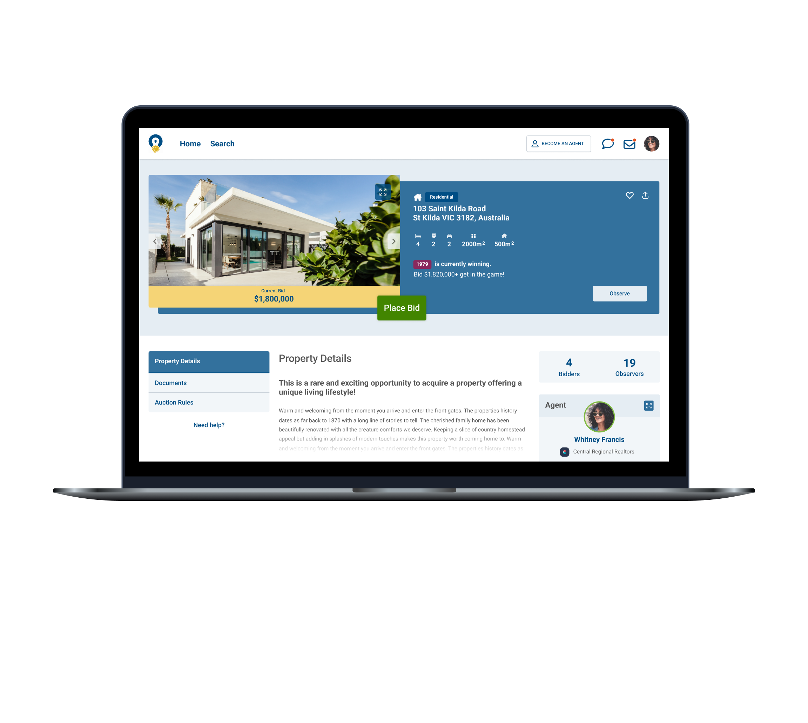
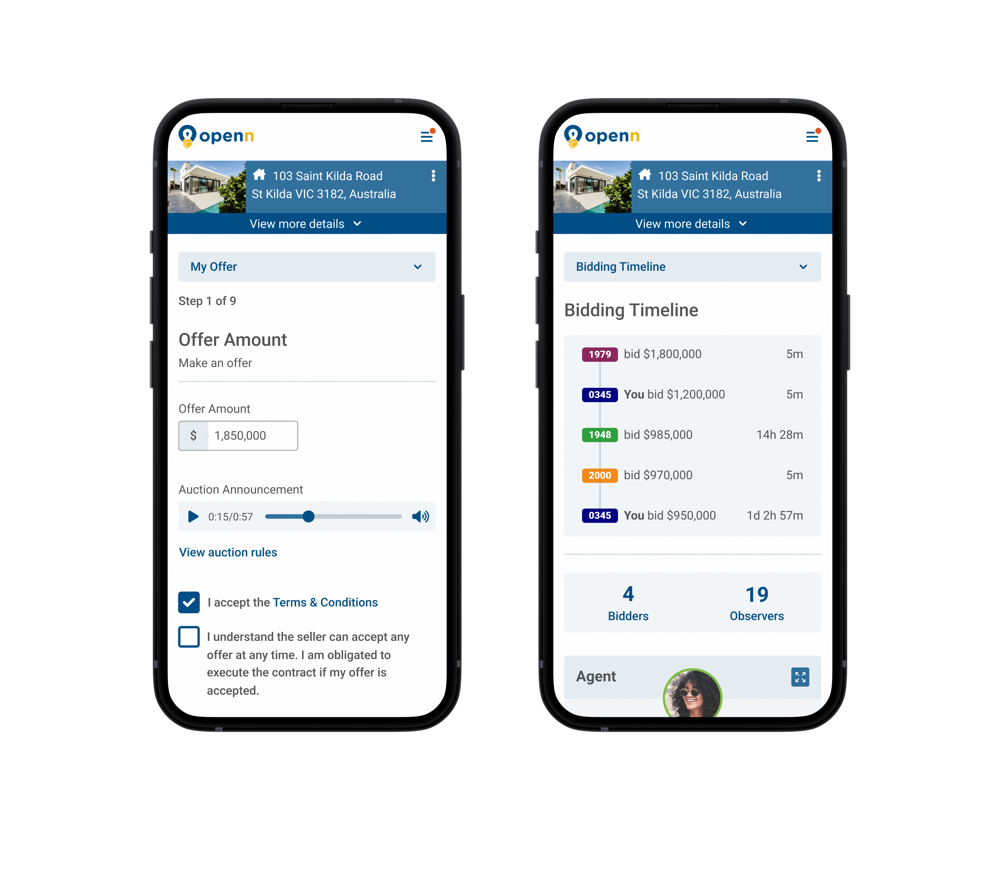
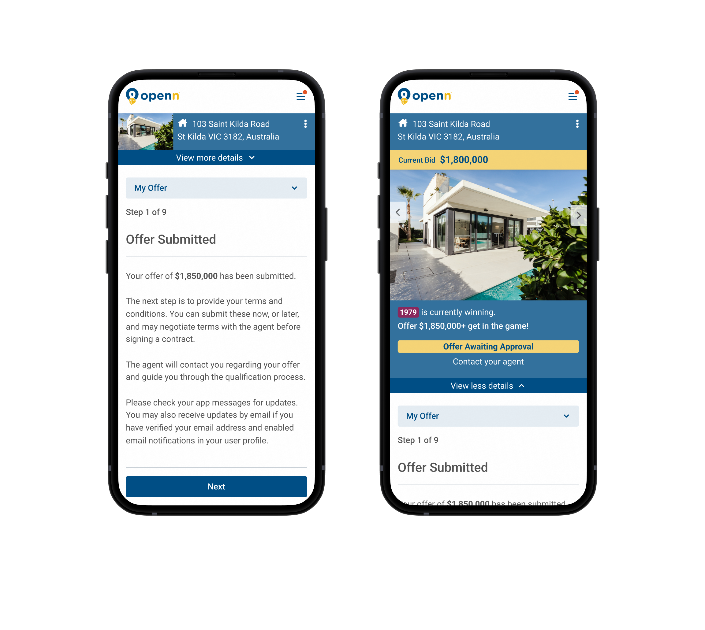
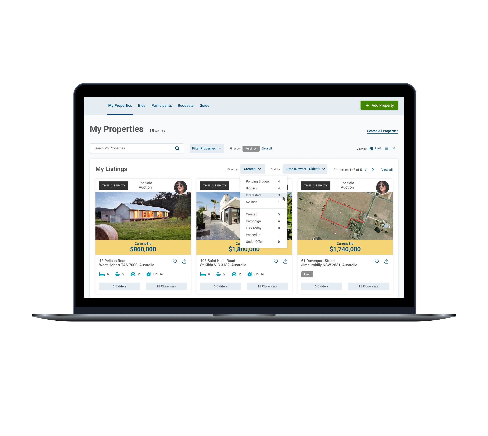
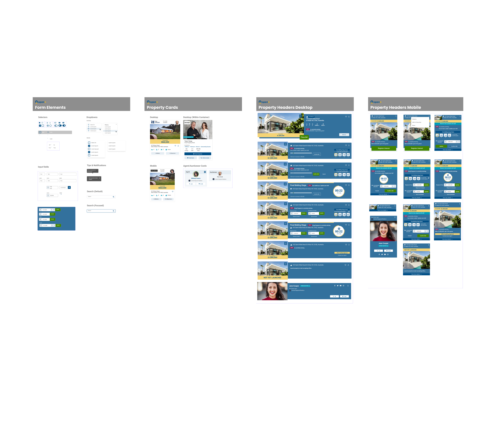

<!-- Main -->

<!-- One -->
<section id="one">
	

		<header class="major">
			<h2>Project Summary</h2>
		</header>
		<dl>
			<dt>My Role</dt>
			<dd>Research, Strategy, UX Design, Visual Design</dd>
			

			<dt>Timeframe</dt>
			<dd>17 weeks</dd>
			

			<dt>Outcome</dt>
			<dd>Simplified online home buying experience for increased trust</dd>
		</dl>
	

</section>

<!-- Two -->
<section id="two" class="spotlights">
	<section>
		

			
		

		

			

				<header class="major">
					<h3>Client</h3>
				</header>
					
Openn is an online platform based in Australia for buying and selling property. They have multiple ways in which to do this, including online auction and private treaty. During my time at Slide UX I worked on a project to improve Openn’s overall user experience.

			

		

	</section>
	<section>
		

			
		

		

			

				<header class="major">
					<h3>Challenge</h3>
				</header>
					
Openn wanted to overhaul their user experience for a few reasons: to grow their market share, prepare for an expansion to the U.S., and make their product easier to use.

			

		

	</section>
	<section>
		

			
		

		

			

				<header class="major">
					<h3>Users & Audience</h3>
				</header>
					
At the beginning of this project we held a user needs workshop with the Openn team and identified two primary personas in the property selling process: buyers  and selling agents. Each has a specific goal. Buyers are trying to purchase a property. Selling agents are trying to do right by their client and earn their commission. For both sides there is a lot of money on the line and the process can be stressful. So it goes without saying, if that process can be made less painful it would be better for everyone.

			

		

	</section>
	<section>
		

			
		

		

			

				<header class="major">
					<h3>Roles & Responsibilities</h3>
				</header>
					
I worked with two other designers throughout the course of this project, acting as the strategy and design lead for the majority of the engagement. I worked closely with a UI designer and a UX coordinator to deliver new work to the client weekly.

			

		

	</section>
	<section>
		

			
		

		

			

				<header class="major">
					<h3>Scope & Constraints</h3>
				</header>
					
This was a fixed fee, fixed timeline project. Over a period of 17 weeks we met with the Openn team weekly to review new deliverables.

			

		

	</section>
	<section>
		

			
		

		

			

				<header class="major">
					<h3>Process / What We Did</h3>
				</header>
					
The process started with a site audit where we identified various usability problems. Then we analyzed alternatives to see what their competitors were doing and to identify how they compared to UX best practices. We created sitemaps and user flows. We did our due diligence. Then we talked to users. This piece was crucial for us to get Australians’ perspective on the process, since as Americans we were pretty new to it. We walked buyers and agents through the process and learned their goals, likes, and pain points. One of the biggest things that stood out was that buyers felt there wasn’t enough connection between the process and the property they were trying to purchase. So we set out to fix that, among other things.

			

		

	</section>
	<section>
		

			
		

		

			

					
We created wireframes for some of the more complex screens to discuss our ideas with the Openn team. We designed a header that would exist in various forms throughout the entire purchasing process from a property’s description through the actual purchase. This header included photos and basic details about the property, as well as actions to be taken to proceed to the next step of the process. It serves as an anchor for every screen, a reminder to the user of why they’re doing what they’re doing (such as submitting an offer or defining their terms and conditions).

			

		

	</section>
	<section>
		

			
		

		

			

					
Another area we worked on was a new process for moving potential buyers through the process of filling out all the required “paperwork”. We switched from a system of confusing tabs to a stepped experience which helps people see where they are in the process and how far they are from completion. And, of course, there is the ever-present header which reminds them why they are doing this in the first place: to buy a property.

			

		

	</section>
	<section>
		

			
		

		

			

					
Once we knew we were aligned on wireframes, we created a visual design concept based on a basic style guide shared with us by the Openn marketing team. When we agreed on a look and feel, we applied it to the wireframes we had created thus far.

			

		

	</section>
	<section>
		

			
		

		

			

					
Once we had some screens fleshed out, it was time to test them with users. We conducted interviews with a handful of participants, some of whom participated in our initial research. It was great getting to walk through the new designs with people we had talked to previously and see their reactions, which were very positive. Among other things, they saw a new connection between property and process, and felt satisfied that their feedback had been heard. All participants able to complete tasks without any trouble. Some minor issues were identified (such as a share icon which no one understood) and addressed in further iteration.

			

		

	</section>
	<section>
		

			
		

		

			

					
From there we built out some additional key screens, focusing on creating components the Openn team could use to create the rest of the screens they would need to round out the experience. We also created a design system using components we made to build out screens. Our final deliverable was a Figma file.

			

		

	</section>
	<section>
		

			
		

		

			

				<header class="major">
					<h3>Outcomes & Lessons</h3>
				</header>
					
Designing a product to be used in multiple countries can be challenging. In our research we learned that Australian and U.S. users had differing perspectives; Americans aren’t as familiar with purchasing properties at auction, and tend to have preconceived notions of what that means (foreclosures, mainly). One of the things we learned is that, especially when designing for users with different points of reference, it is important to provide the right information at the right time so as to help users understand the process but not be overwhelmed.

			

		

	</section>
</section>

<!-- Three -->
<section id="three">
	

		

			

			<header class="major">
				<h3>More Case Studies</h3>
			</header>
			<ul>
				<li><a href="cs1-ameritas">Sales Insights Dashboard</a></li>
				<li><a href="cs3-abr">Remote Oral Exam Design</a></li>
				<li><a href="cs4-apfm">Optimized Post-Lead Experience</a></li>
				<li><a href="cs5-motion">Product Configurator Feature</a></li>
				<li><a href="cs6-leankit">Benefits Page Improvement</a></li>
			</ul>
		

	

	

</section>

