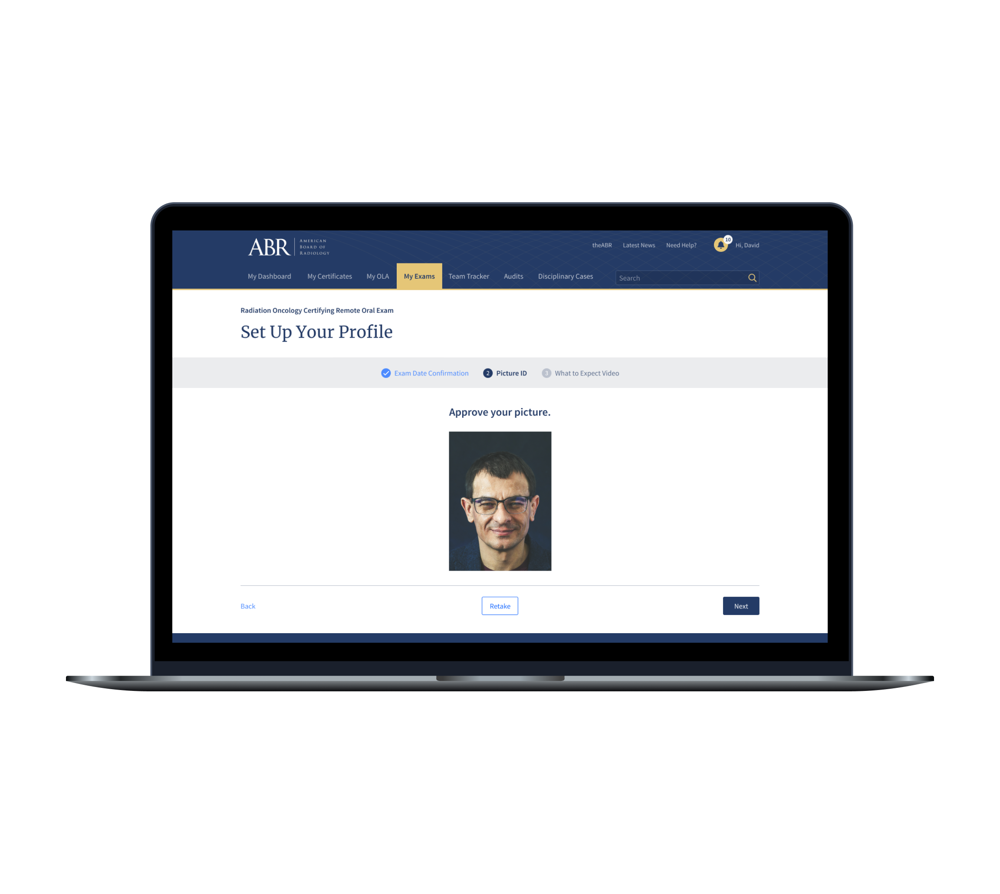
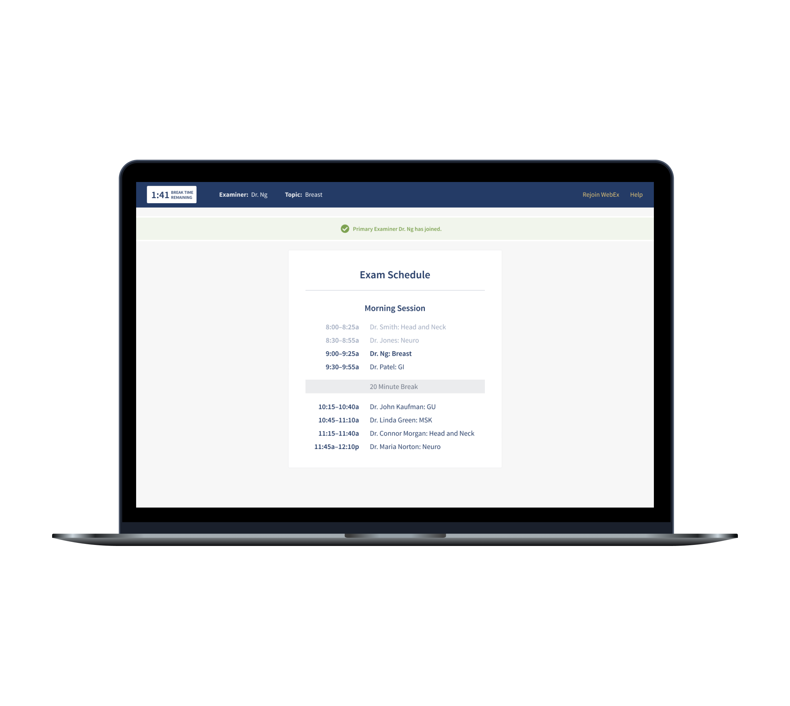
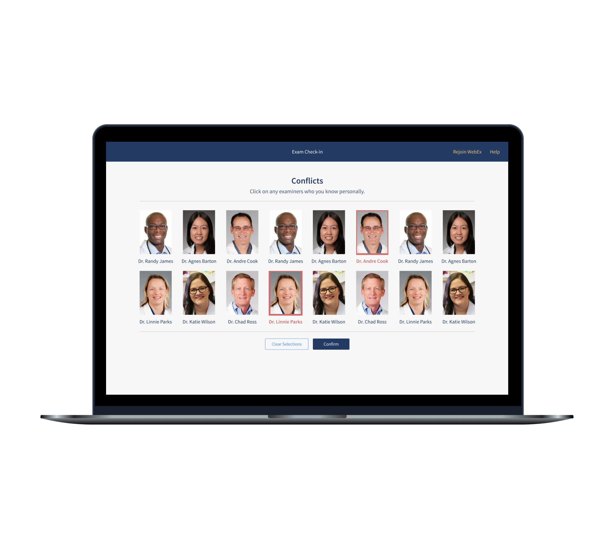
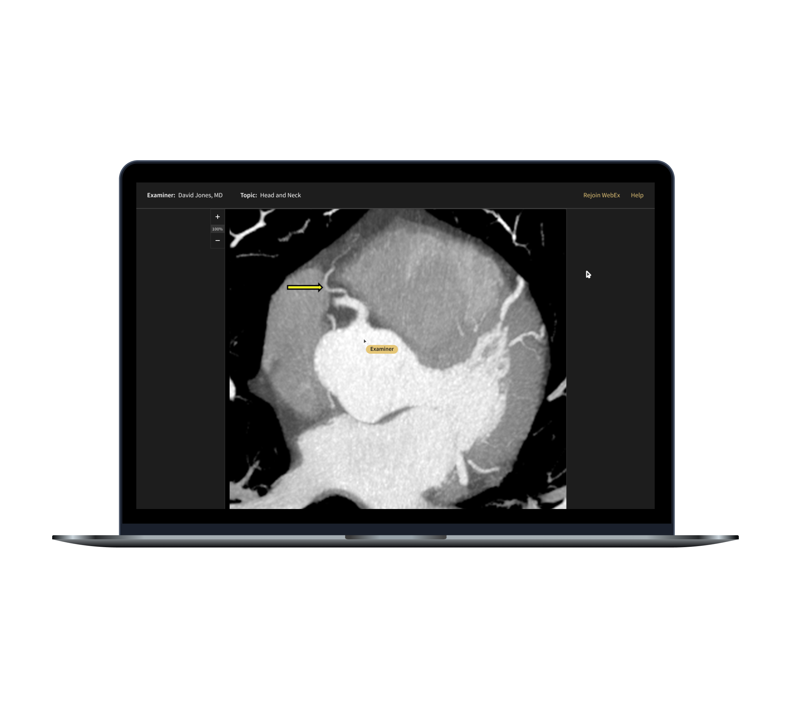
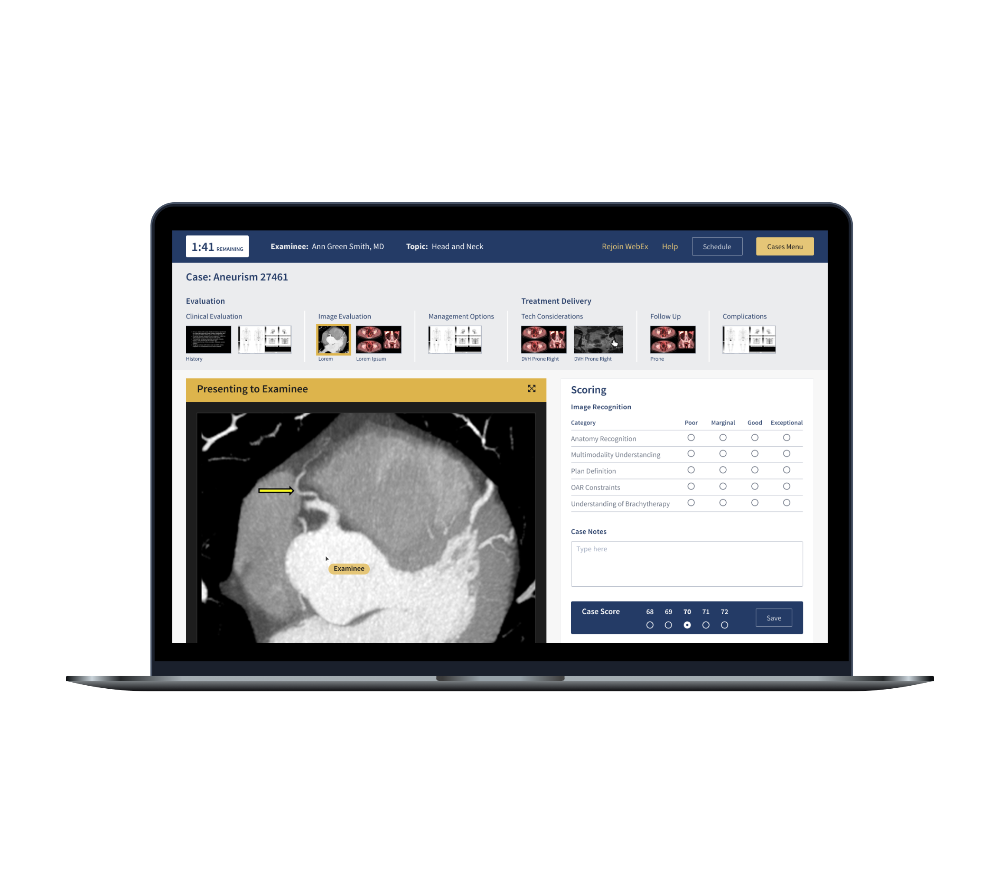
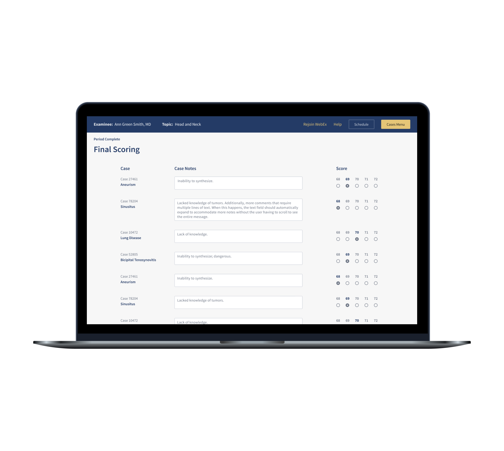
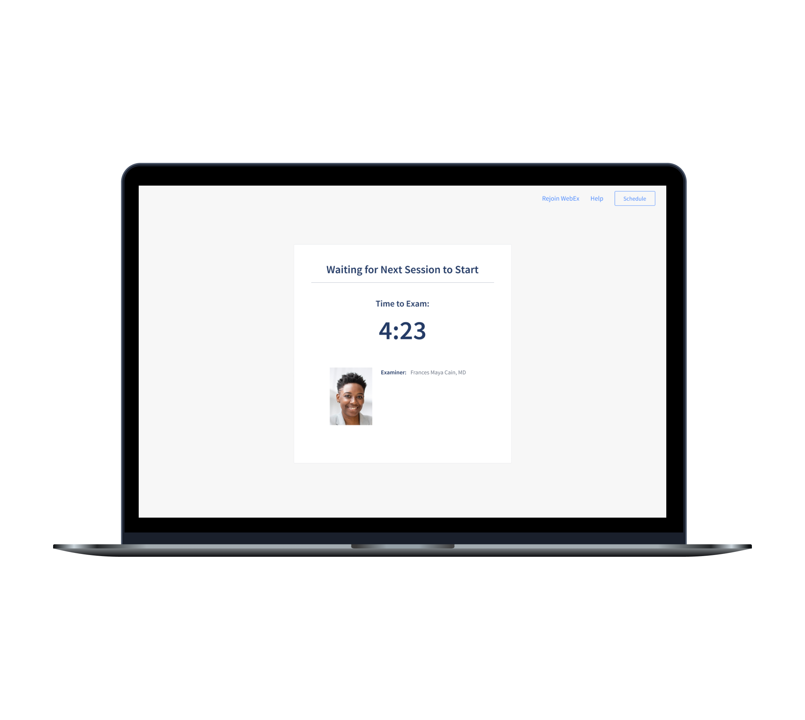

<!-- Main -->

<!-- One -->
<section id="one">
	

		<header class="major">
			<h2>Project Summary</h2>
		</header>
		<dl>
			<dt>My Role</dt>
			<dd>User Experience, Visual Design</dd>
			

			<dt>Timeframe</dt>
			<dd>6 weeks</dd>
			

			<dt>Outcome</dt>
			<dd>Remote web experience for a previously in-person exam, still in use today</dd>
		</dl>
	

</section>

<!-- Two -->
<section id="two" class="spotlights">
	<section>
		

			
		

		

			

				<header class="major">
					<h3>Client</h3>
				</header>
					
The American Board of Radiology (ABR) is a non-profit association that oversees the certification and ongoing professional development of physician specialists. The ABR certifies its diplomates through a comprehensive process involving educational requirements, professional peer evaluation, and examination.

			

		

	</section>
	<section>
		

			
		

		

			

				<header class="major">
					<h3>Challenge</h3>
				</header>
					
One of the main pieces of the ABR’s certification process is an oral exam. In the past this exam was taken in person at a conference setting. People would travel to attend and take their exams, which would last a few days. That all changed with the advent of COVID-19; travel was too risky. Exams were still necessary, though, so the ABR needed to bring the oral exam online.

			

		

	</section>
	<section>
		

			
		

		

			

				<header class="major">
					<h3>Users & Audience</h3>
				</header>
					
We designed primarily for two personas: the people taking the exams (examinees) and the people administering it (examiners).

			

		

	</section>
	<section>
		

			
		

		

			

				<header class="major">
					<h3>Roles & Responsibilities</h3>
				</header>
					
For this project I served as the lead designer. I worked with another designer who had a long history with the client, they conducted internal reviews and provided feedback throughout the process.

			

		

	</section>
	<section>
		

			
		

		

			

				<header class="major">
					<h3>Scope & Constraints</h3>
				</header>
					
This was a 6 week engagement. We met weekly with the client to review screens and collect feedback.

			

		

	</section>
	<section>
		

			
		

		

			

				<header class="major">
					<h3>Process / What We Did</h3>
				</header>
					
This project was mainly a visual design effort. The ABR team provided some basic wireframes to serve as minimum requirements for the user experience, but they were open to suggestions and recommendations along the way. We were working from an existing experience, the in-person oral exam, so we weren’t starting from scratch. But there were things to be considered, such as proof of identity and what might happen if someone were to lose internet connection during an exam.

					
There was a bit of a learning curve for me as I wrapped my head around how the exam worked previously and how it should work moving forward; every meeting was a learning opportunity. Fortunately, the ABR team is as gracious as they are intelligent, and they excel at collaboration.

					
Throughout the engagement we had meetings with a larger group of board members (physicians) in order to collect feedback from a variety of disciplines. These doctors were also users, so their feedback was valuable. In the end we arrived at a solution that was simple and user friendly.

			

		

	</section>
	<section>
		

			
		

		

			

				<header class="major">
					<h3>Outcomes & Lessons</h3>
				</header>
					
The ABR remote oral exam has been taken by thousands of physicians since its launch in early 2021 and the feedback has been hugely positive. It has enabled people to take their exams in the comfort of their own home, which has reduced stress surrounding the exam process. A lot rides on this exam, so making it more accessible to doctors is a big win. The ABR and Slide UX have continued to iterate on the exam throughout 2021.

					
Of the projects I had the opportunity to work on during my time at Slide UX, I am perhaps most proud of this one. It was rewarding to design something in response to COVID-19. In a time when there was so much I couldn’t do anything about, it felt good to contribute to making the world a safer place in some small way.

			

		

	</section>
</section>

<!-- Three -->
<section id="three">
	

		

			

			<header class="major">
				<h3>More Case Studies</h3>
			</header>
			<ul>
				<li><a href="cs1-ameritas">Sales Insights Dashboard</a></li>
				<li><a href="cs2-openn">Home Buying UX Improvement</a></li>
				<li><a href="cs4-apfm">Optimized Post-Lead Experience</a></li>
				<li><a href="cs5-motion">Product Configurator Feature</a></li>
				<li><a href="cs6-leankit">Benefits Page Improvement</a></li>
			</ul>
		

	

	

</section>

