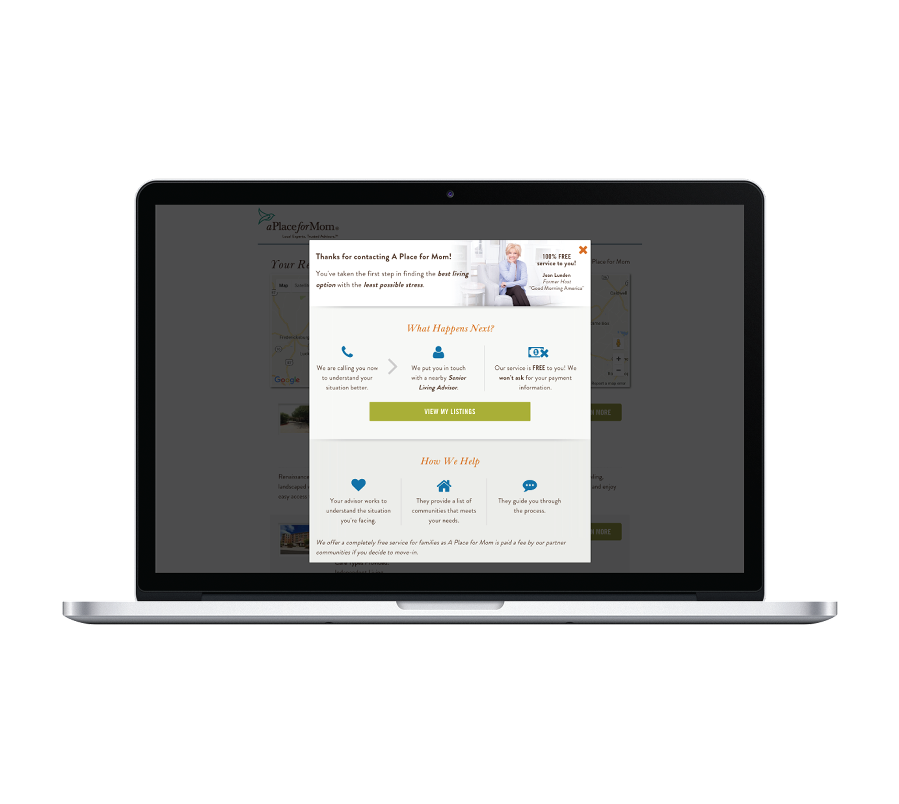
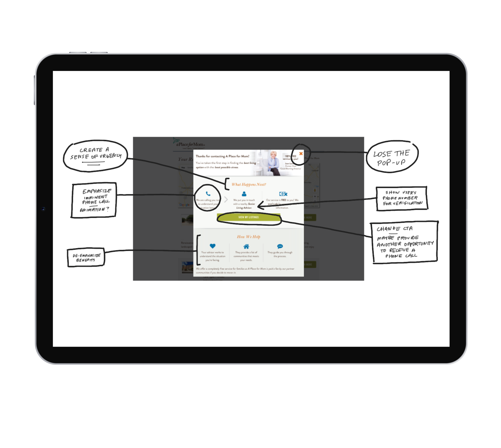
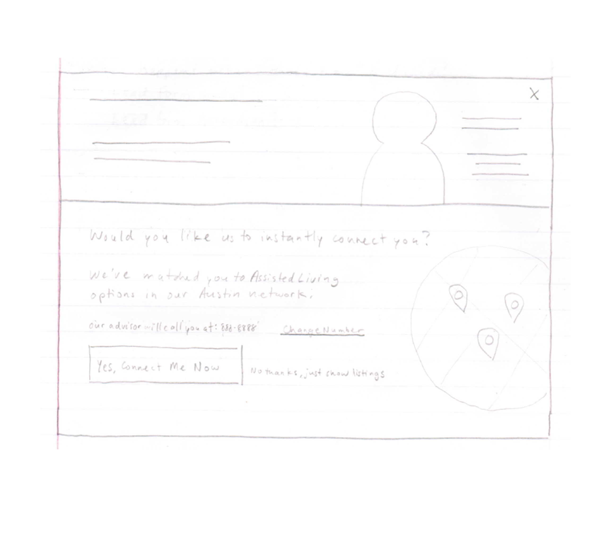
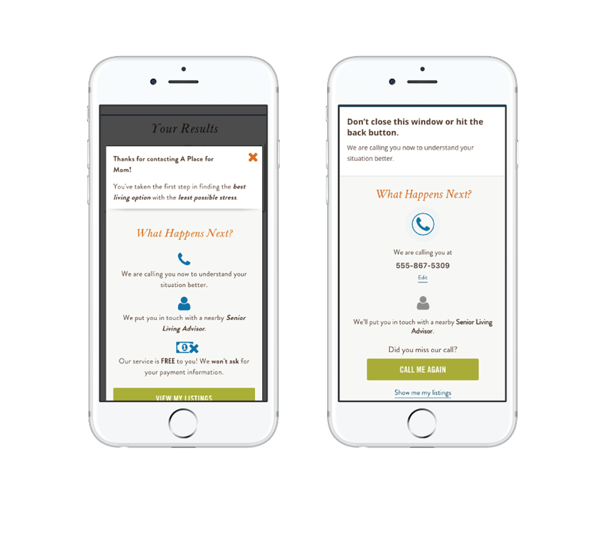
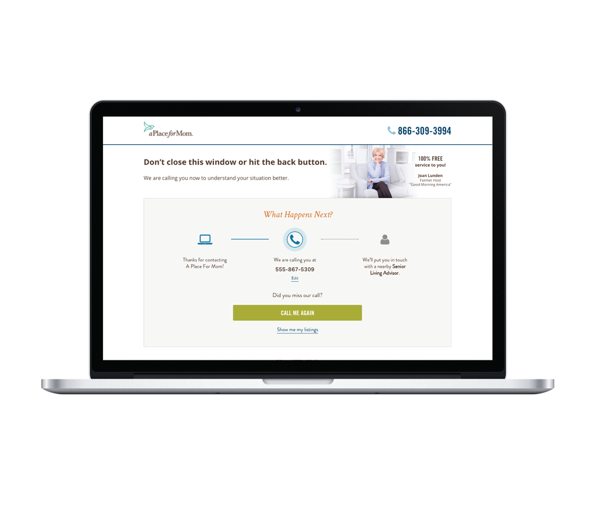

<!-- Main -->

<!-- One -->
<section id="one">
	

		<header class="major">
			<h2>Project Summary</h2>
		</header>
		<dl>
			<dt>My Role</dt>
			<dd>UX Design, Visual Design, Development, Testing</dd>
			

			<dt>Timeframe</dt>
			<dd>4 weeks</dd>
			

			<dt>Outcome</dt>
			<dd>Redesigned thank you page for 15% increase in referred leads</dd>
		</dl>
	

</section>

<!-- Two -->
<section id="two" class="spotlights">
	<section>
		

			
		

		

			

				<header class="major">
					<h3>Client</h3>
				</header>
					
A Place For Mom is the largest assisted living referral service. The heart of their process is getting help from a local advisor who helps families find the best option for them. Most of the communication involved takes place over the phone. Two big challenges they face are getting users to submit their phone number in a lead form, and then getting them to answer the phone when the call comes. For this test I focused on the second challenge.

			

		

	</section>
	<section>
		

			
		

		

			

				<header class="major">
					<h3>Challenge</h3>
				</header>
					
It all started with a conversation I had with a colleague who specializes in the post-lead experience (everything that happens after a user fills out a form). They mentioned the number of users who answered the initial phone call was surprisingly low, so I started drilling into possible explanations. I found out that the timeframe between a user submitting a lead and receiving a call was less than a minute.

					
I thought about my own mother, and how she never answers the phone on the first call, because she never keeps her phone on her. And I speculated that a fair amount of people might not associate the ringing phone with the form they just filled out on their computer. So I decided to test preparing users to receive a call on our thank you page.

					
At the time, the current thank you page treatment did explain the next steps of the process and what to expect. However, there was a lot of information being presented, and it was a lot to digest. Additionally, the thank you page didn't make it clear to the user that they were going to receive a phone call right away. I hypothesized that by simplifying the thank you page and focusing on the fact that users were about to receive a call any moment, we could increase the number of people answering the call.

			

		

	</section>
	<section>
		

			
		

		

			

				<header class="major">
					<h3>Hypothesis</h3>
				</header>
					
If we educate users about the process and prepare them to receive a phone call right away, we can increase referred leads by 10%.

			

		

	</section>
	<section>
		

			
		

		

			

				<header class="major">
					<h3>Solution</h3>
				</header>
					
My main goals in designing this solution were to simplify the content on the thank you page and draw attention to the most important next step: receiving a call.

					
I started by de-emphasizing the benefits section at the bottom of the page, opting for a simple bulleted list view, as opposed to a full width horizontal section with icons.

					
I used color to de-emphasize the completed step and emphasize the current step. I used an animated icon to draw attention to the current step, since that's the most important task at hand. I included the phone number submitted in the messaging for a more personalized experience.

					
I changed the main headline of the page from a generic "thank you" message to a one sentence instruction to not close the window or navigate away from the page. I also changed the main call to action on the page from "View My Listings", which took them away from that page, to a request to receive another call, in the event they missed the first call.

					
Finally, I made the thank you message a full page design, as opposed to the previous modal version, to make the whole thing a bit clearer and remove visual distraction and the inherent desire most users have to close a modal without reading it.

			

		

	</section>
	<section>
		

			
		

		

			

				<header class="major">
					<h3>Results & Iteration</h3>
				</header>
					
Redesigning the thank you page to focus on next steps produced a 15% increase in referred leads, which in turn, resulted in an estimated $1.2MM bump in annual revenue.

			

		

	</section>
</section>

<!-- Three -->
<section id="three">
	

		

			

			<header class="major">
				<h3>More Case Studies</h3>
			</header>
			<ul>
				<li><a href="cs1-ameritas">Sales Insights Dashboard</a></li>
				<li><a href="cs2-openn">Home Buying UX Improvement</a></li>
				<li><a href="cs3-abr">Remote Oral Exam Design</a></li>
				<li><a href="cs5-motion">Product Configurator Feature</a></li>
				<li><a href="cs6-leankit">Benefits Page Improvement</a></li>
			</ul>
		

	

	

</section>

