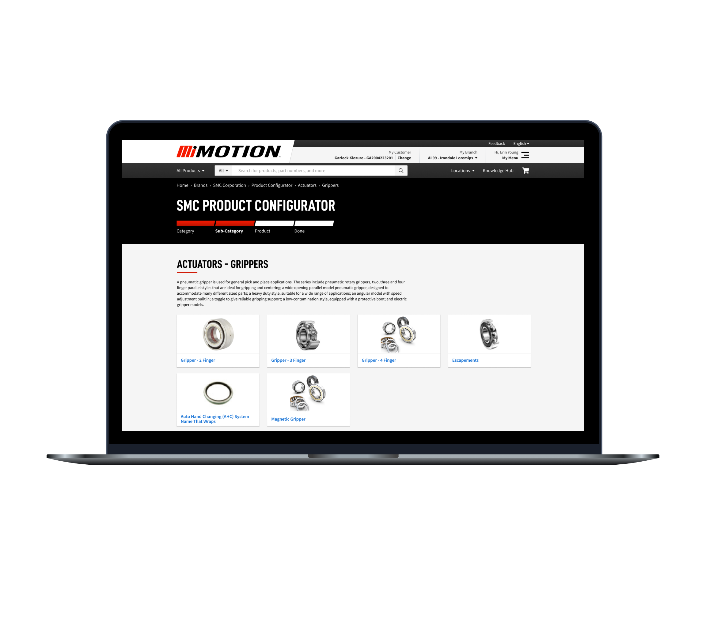
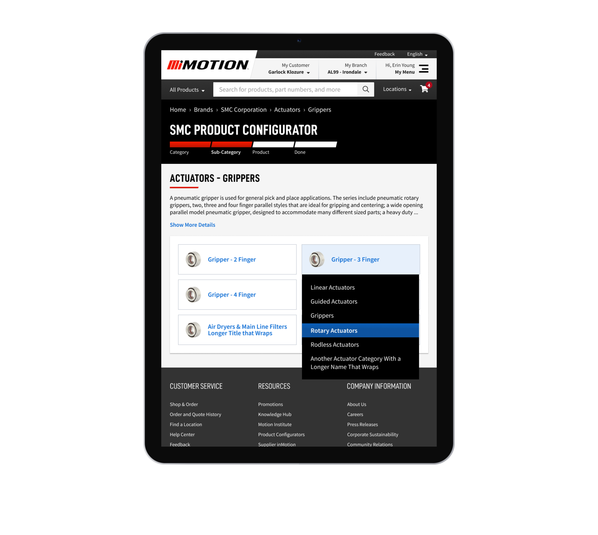
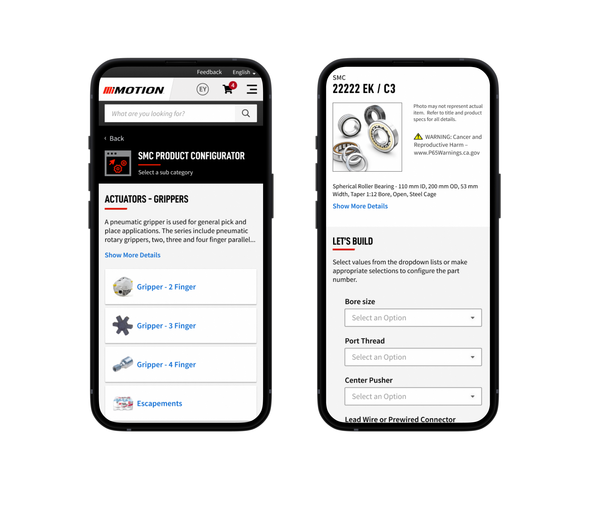
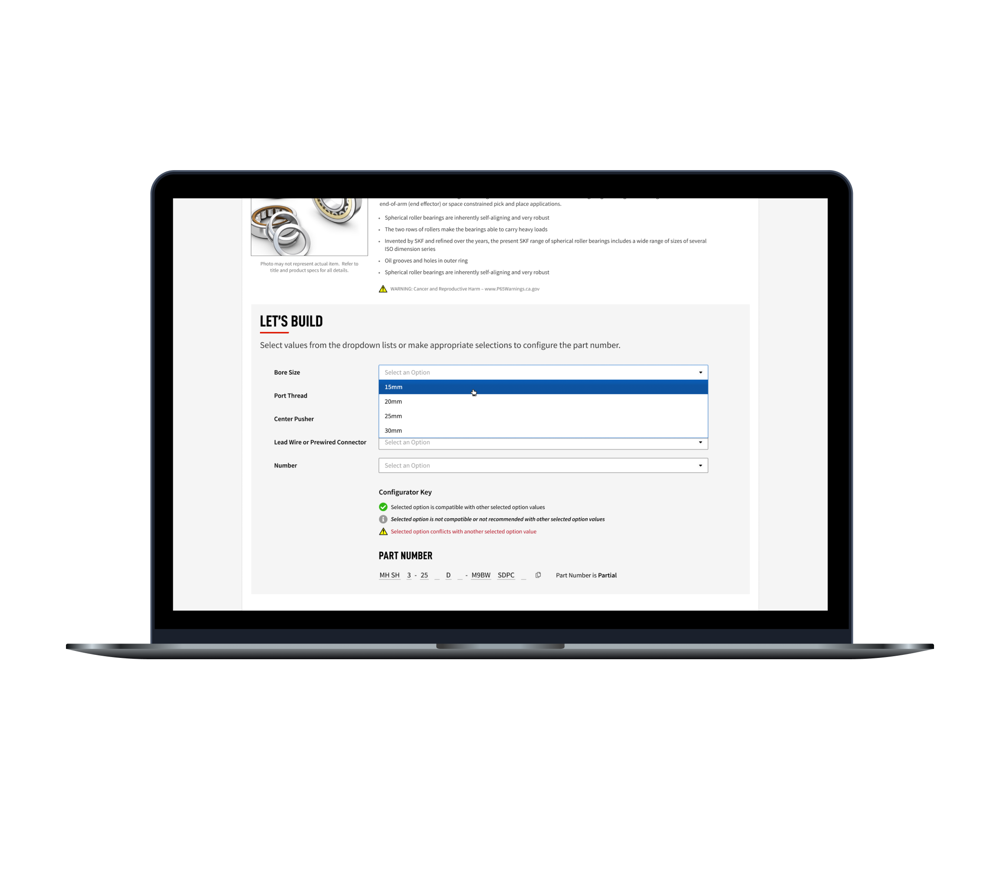
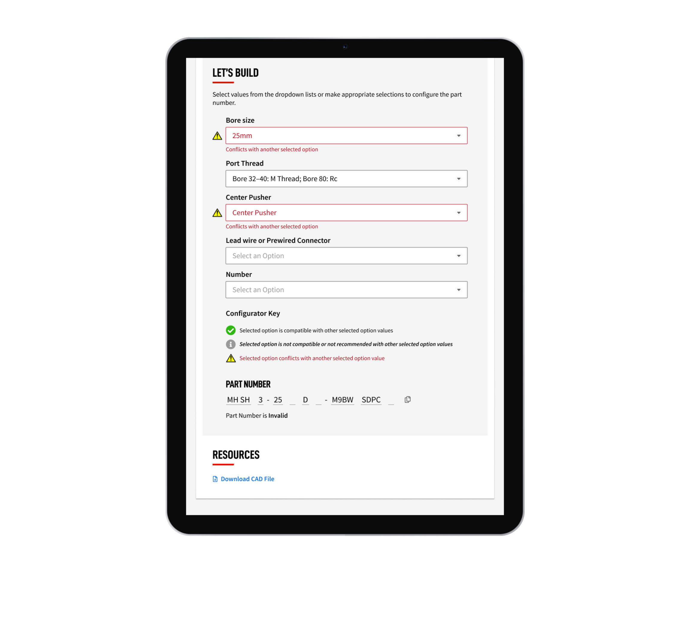
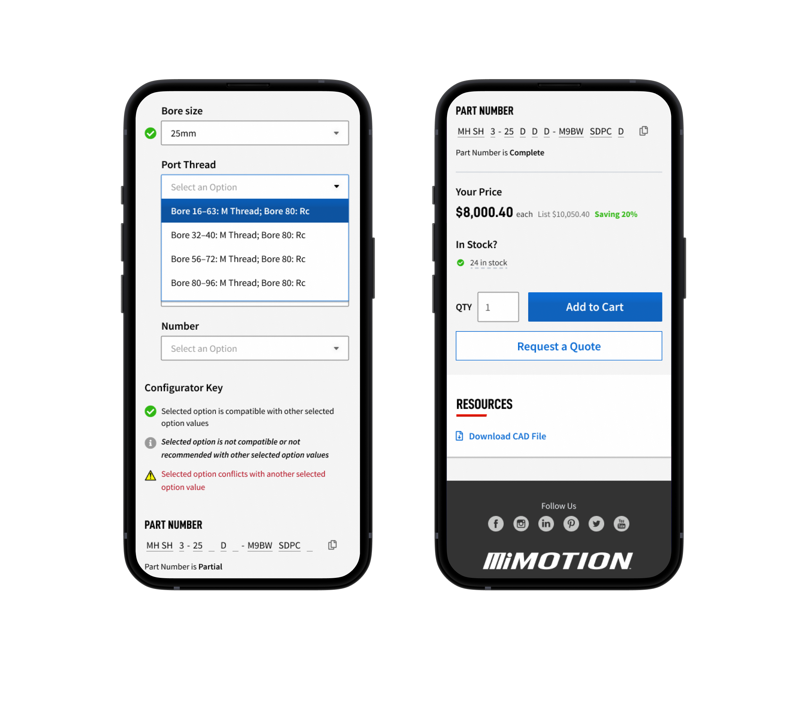
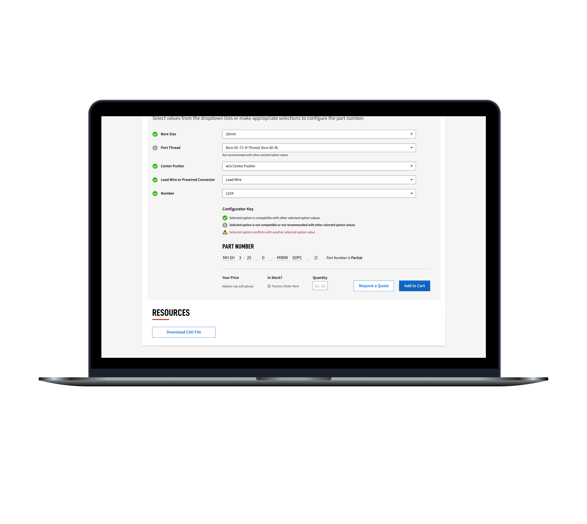

<!-- Main -->

<!-- One -->
<section id="one">
	

		<header class="major">
			<h2>Project Summary</h2>
		</header>
		<dl>
			<dt>My Role</dt>
			<dd>UX Design, Visual Design</dd>
			

			<dt>Timeframe</dt>
			<dd>3 weeks</dd>
			

			<dt>Outcome</dt>
			<dd>Configurator feature for better product search</dd>
		</dl>
	

</section>

<!-- Two -->
<section id="two" class="spotlights">
	<section>
		

			
		

		

			

				<header class="major">
					<h3>Client</h3>
				</header>
					
Motion Industries is one of the largest distributors of industrial parts in the world. They are a retainer client at Slide UX, who has handled the design of their website and mobile app for several years now. I worked on Motion’s web experience for most of my time with Slide UX, and had the opportunity to work on a wide variety of projects and features.

			

		

	</section>
	<section>
		

			
		

		

			

				<header class="major">
					<h3>Challenge</h3>
				</header>
					
The Motion Industries website has an overwhelming amount of products to choose from. There are hundreds of thousands, maybe even millions. And while they have a good search and filtering system in place, sometimes it can still be tricky to find the exact match for the part you need. Motion wanted to build a feature on their site to help walk customers through the process of finding the right part without getting confused or overwhelmed.

			

		

	</section>
	<section>
		

			
		

		

			

				<header class="major">
					<h3>Users & Audience</h3>
				</header>
					
For this project we designed for Motion customers, who can be anyone from an executive at a major parts supplier to a direct consumer.

			

		

	</section>
	<section>
		

			
		

		

			

				<header class="major">
					<h3>Roles & Responsibilities</h3>
				</header>
					
For this project I served as UX and visual designer, offering recommendations on how the experience should work and creating the necessary screens to be implemented. I worked with a managing director who provided feedback throughout the project.

			

		

	</section>
	<section>
		

			
		

		

			

				<header class="major">
					<h3>Scope & Constraints</h3>
				</header>
					
This was a retainer client engagement, with a certain amount of dedicated hours per week. This project was completed in a 3 week timeframe. I created designs based on the existing style guide we had built. We met with the client in a standing weekly meeting to review progress and collect feedback.

			

		

	</section>
	<section>
		

			
		

		

			

				<header class="major">
					<h3>Process / What We Did</h3>
				</header>
					
For this project, the Motion team provided requirements for the feature, as well as references to some similar experiences they liked. After doing some research into these alternatives I designed a comparable experience that met their requirements and added some improvements based on best practices and existing patterns.

					
One of my main concerns while working on this feature was feedback and interaction. The idea was to create a multi-step process to guide a customer through a complicated process of finding the right part. This required clear visual cues to indicate required and current selections, and consideration of how things would be handled on various screen sizes and devices.

					
Lastly, as this was a process with multiple tiers, it was important to provide feedback to let the user know where they are in that process and how close they are getting to finding the part they need. I came up with a simple indicator which would live at the top of the screen and serve as a reassurance that progress was being made toward reaching the desired outcome.

			

		

	</section>
	<section>
		

			
		

		

			

				<header class="major">
					<h3>Outcomes & Lessons</h3>
				</header>
					
The SMC Product Configurator was launched in 2021 and was a big success. The Motion team was so pleased with its performance they started thinking of ways they could take a similar approach in other areas of the site.

			

		

	</section>
</section>

<!-- Three -->
<section id="three">
	

		

			

			<header class="major">
				<h3>More Case Studies</h3>
			</header>
			<ul>
				<li><a href="cs1-ameritas">Sales Insights Dashboard</a></li>
				<li><a href="cs2-openn">Home Buying UX Improvement</a></li>
				<li><a href="cs3-abr">Remote Oral Exam Design</a></li>
				<li><a href="cs4-apfm">Optimized Post-Lead Experience</a></li>
				<li><a href="cs6-leankit">Benefits Page Improvement</a></li>
			</ul>
		

	

	

</section>

