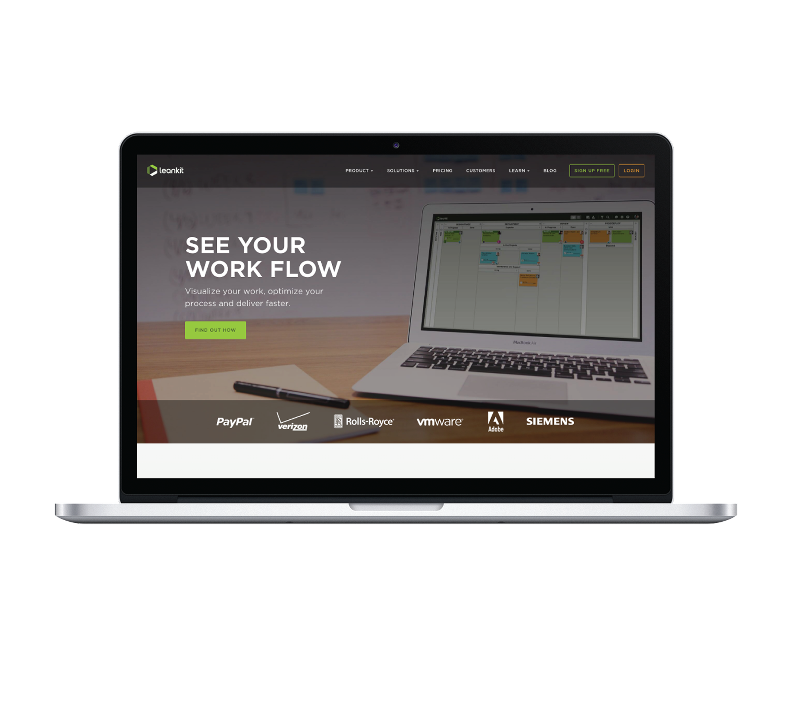
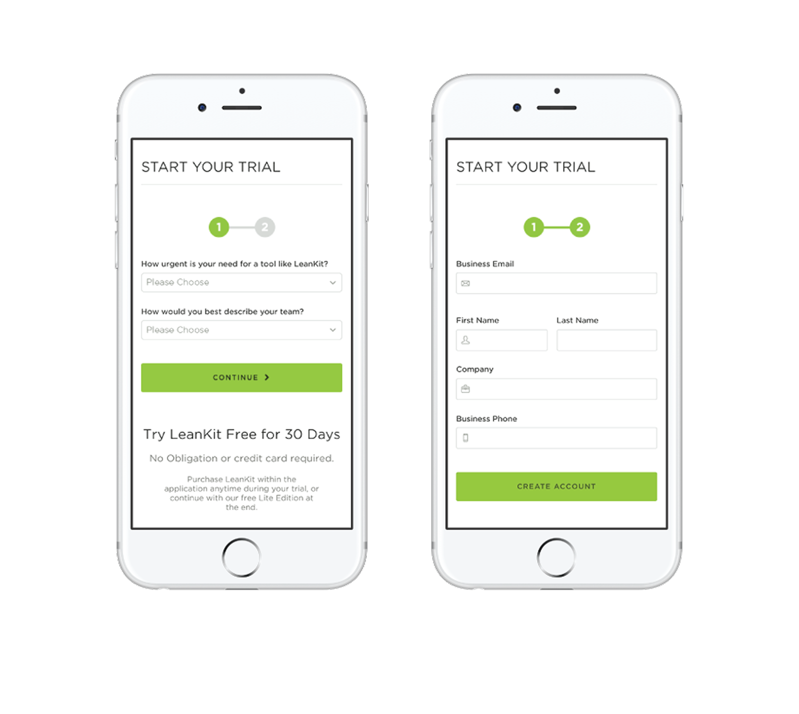
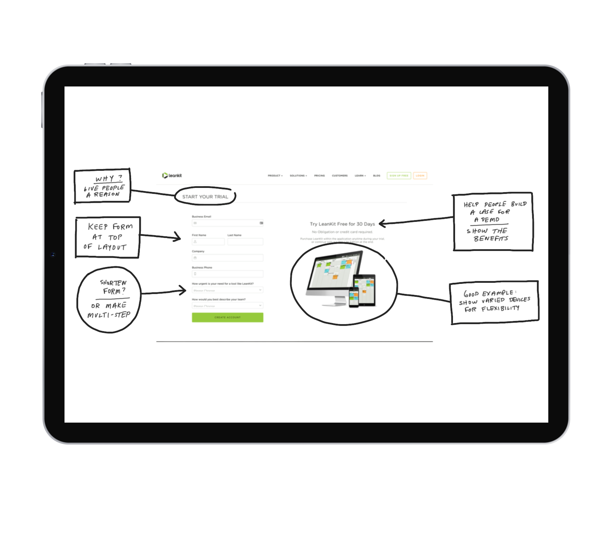
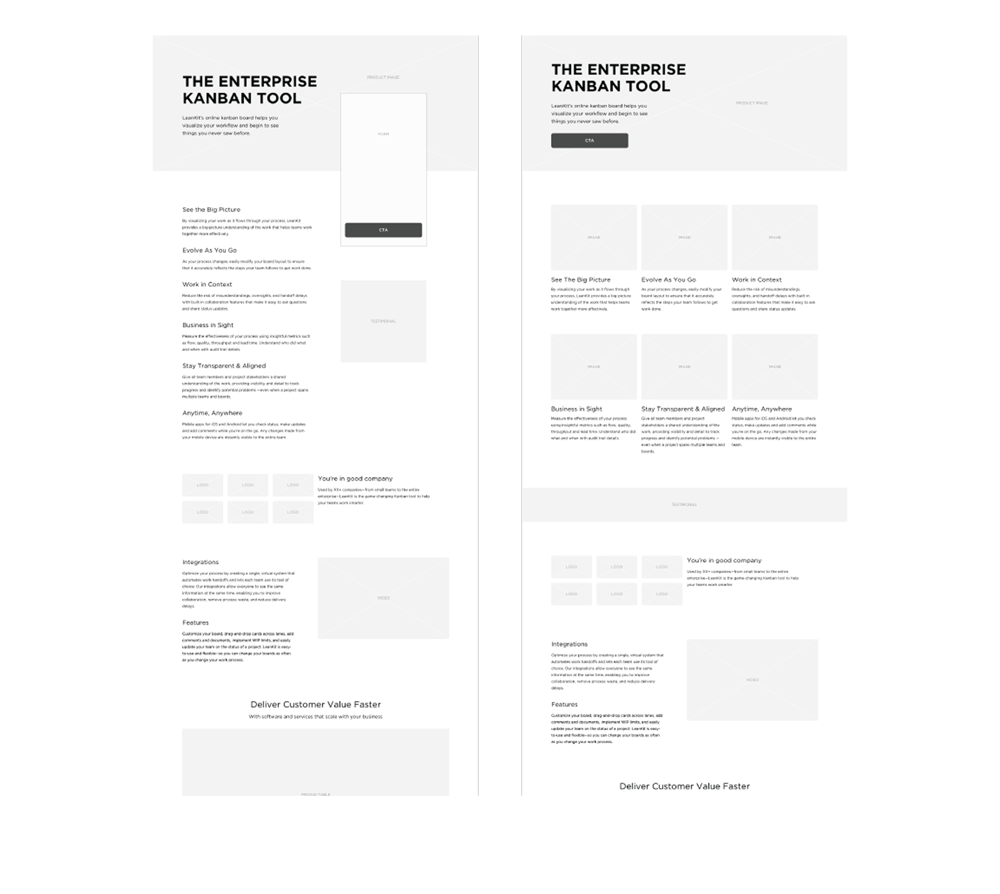
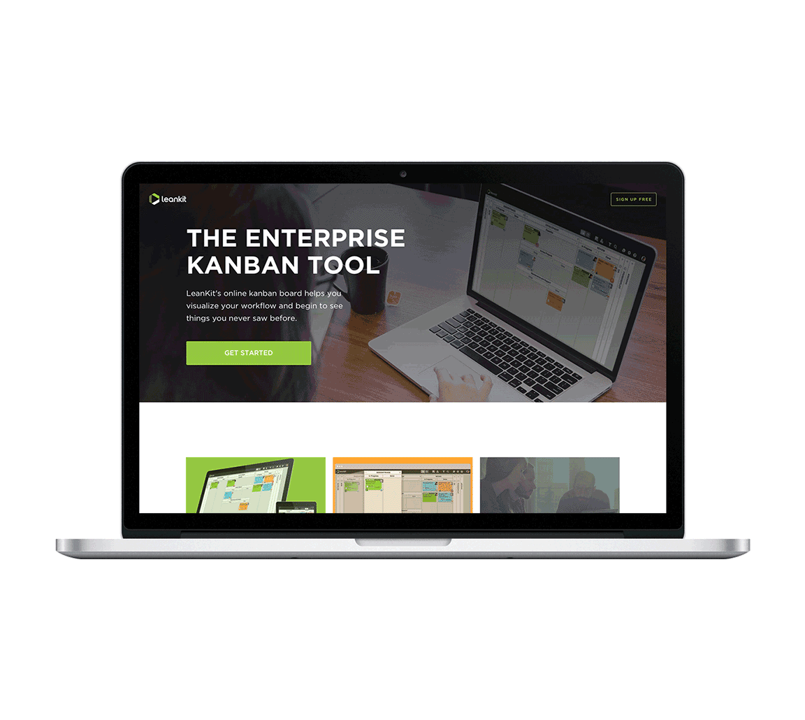

<!-- Main -->

<!-- One -->
<section id="one">
	

		<header class="major">
			<h2>Project Summary</h2>
		</header>
		<dl>
			<dt>My Role</dt>
			<dd>UX Design, Visual Design, Testing</dd>
			

			<dt>Timeframe</dt>
			<dd>2 weeks</dd>
			

			<dt>Outcome</dt>
			<dd>Long-form benefits page for 11% increase in conversion</dd>
		</dl>
	

</section>

<!-- Two -->
<section id="two" class="spotlights">
	<section>
		

			
		

		

			

				<header class="major">
					<h3>The Challenge</h3>
				</header>
					
<strong>The Problem:</strong> LeanKit, an enterprise kanban application, had an overwhelming amount of valuable content, including features, social proof, and testimonials. The conventional wisdom was to cut content, but this posed a strategic challenge for B2B decision-makers who needed extensive information to evaluate the product.

					<ul>
						<li><strong>Result:</strong> A website with high-value content that was not effectively guiding users to a conversion.</li>
						<li><strong>Core Issue:</strong> The existing design failed to account for the unique information needs of B2B buyers who required a comprehensive, educational experience to make a purchasing decision.</li>
					</ul>
			

		

	</section>
	<section>
		

			
		

		

			

				<header class="major">
					<h3>My Role</h3>
				</header>
					
I served as the <strong>UX and visual designer</strong>, responsible for redesigning the benefits page to meet the needs of a highly-specific audience.

					<ul>
						<li><strong>My Contribution:</strong> My role was to leverage user research and design best practices to create a long-form page that strategically presented information in an easily digestible, conversion-focused format.</li>
					</ul>
			

		

	</section>
	<section>
		

			
		

		

			

				<header class="major">
					<h3>The Process</h3>
				</header>
					
My approach was to challenge the assumption that "less is more" by designing a long-form experience tailored for decision-makers.

					<ul>
						<li><strong>Research & Personas:</strong> I developed personas that recognized the audience's need for detailed information—such as white papers, testimonials, and feature comparisons—to make an informed corporate purchasing decision.</li>
						<li><strong>Information Architecture:</strong> I focused on breaking up the content into easily digestible, scannable sections, ensuring a clear information hierarchy.</li>
						<li><strong>Mobile-First Design:</strong> I applied a mobile-first approach and designed a responsive layout that would function effectively on various devices, ensuring a seamless experience for all users.</li>
						<li><strong>Strategic Imagery:</strong> I used product imagery to build trust and show the application in use, directly addressing the user's desire to compare features and understand the product's functionality.</li>
					</ul>
			

		

	</section>
	<section>
		

			
		

		

			

				<header class="major">
					<h3>The Solution</h3>
				</header>
					
I designed a long-form benefits page that provided a comprehensive, educational experience. The solution featured a pricing comparison table, clear visual cues, and a mobile-first layout. By presenting all the necessary information in a logical, structured way, the design supported the user's decision-making process rather than overwhelming them.

			

		

	</section>
	<section>
		

			
		

		

			

				<header class="major">
					<h3>The Impact</h3>
				</header>
					
This project successfully demonstrated that a long-form, educational approach was the right strategy for this audience.

					<ul>
						<li><strong>The Result:</strong> The redesigned benefits page produced an <strong>11% increase in conversion</strong>, validating the hypothesis that providing more information in a well-organized format can be a powerful conversion driver.</li>
					</ul>
			

		

	</section>
</section>

<!-- Three -->
<section id="three">
	

		

			

			<header class="major">
				<h3>More Case Studies</h3>
			</header>
			<ul>
				<li><a href="cs1-ameritas">Sales Insights Dashboard</a></li>
				<li><a href="cs2-openn">Home Buying UX Improvement</a></li>
				<li><a href="cs3-abr">Remote Oral Exam Platform</a></li>
				<li><a href="cs4-apfm">Optimized Post-Lead Journey</a></li>
				<li><a href="cs5-motion">Optimized Product Search</a></li>
			</ul>
		

	

	

</section>

